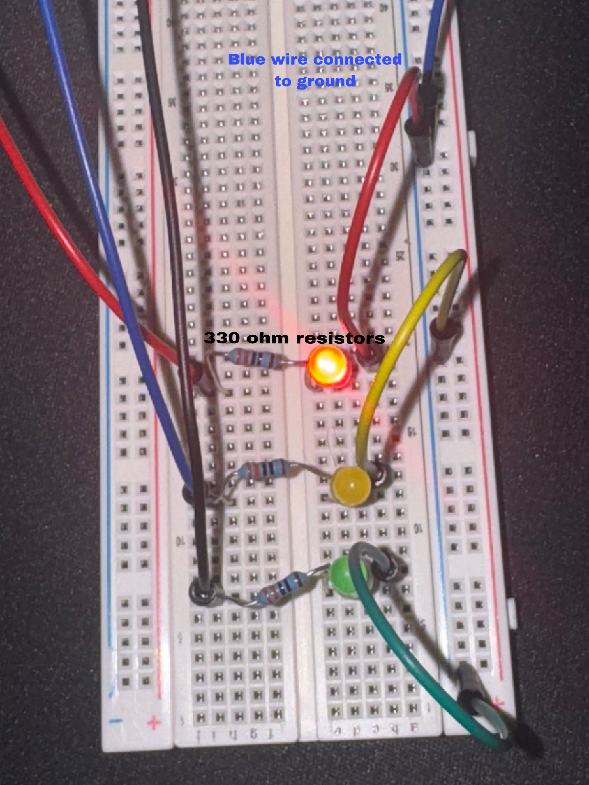
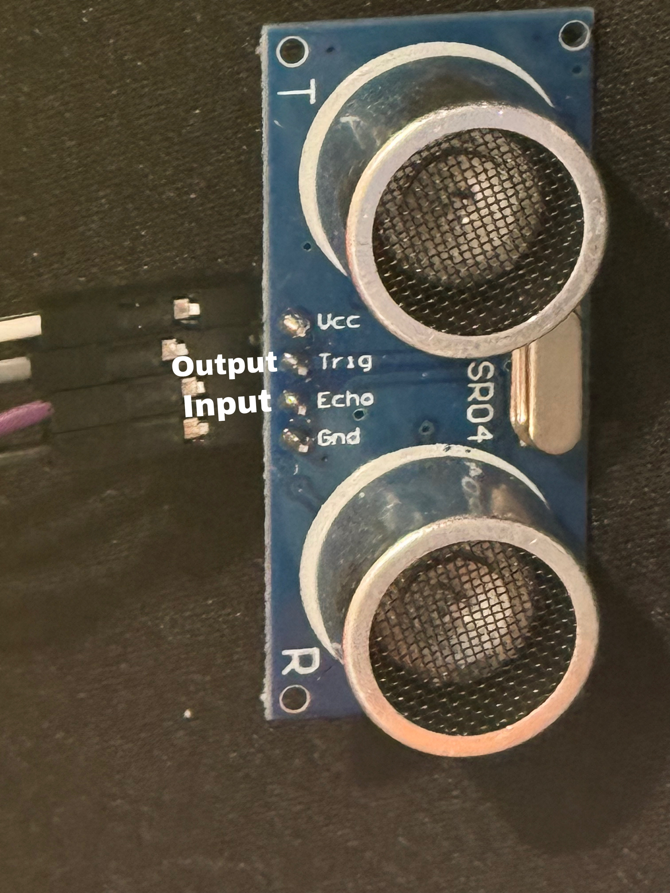
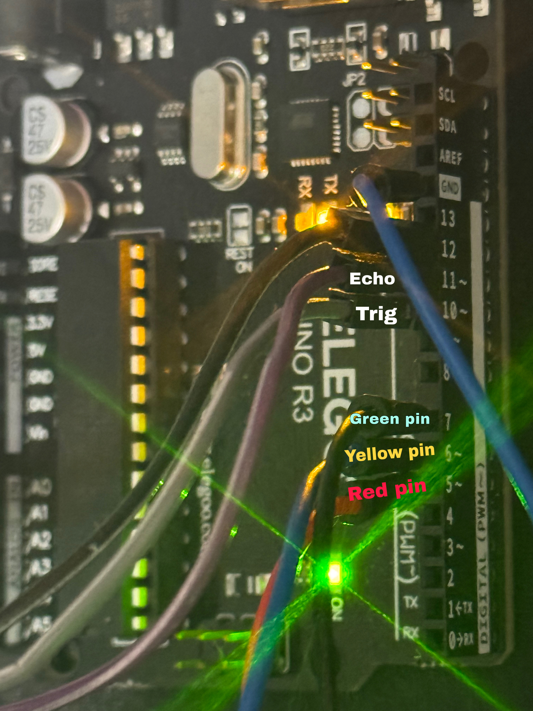

# Phase 1 - Distance Measurement and Visual Warning System

## Objective

The objective of Phase 1 was to develop an ultrasonic proximity warning system capable of detecting nearby objects and providing visual feedback through a three-stage LED warning system.

The project was designed to introduce the fundamentals of embedded systems, sensor integration, electronic circuit construction, and hardware debugging.

---

## Components Used

- Arduino Uno R3
- HC-SR04 Ultrasonic Sensor
- Breadboard
- Jumper Wires
- Green LED
- Yellow LED
- Red LED
- 3 × 330 Ω Resistors

---

## How the Sensor Works

The Arduino sends a short pulse to the TRIG pin of the HC-SR04 ultrasonic sensor.

The sensor emits an ultrasonic sound wave which travels until it strikes an object and reflects back towards the sensor.

The ECHO pin remains HIGH for the duration of the round trip. Using the `pulseIn()` function, the Arduino measures this time and calculates the distance to the object.

The measured distance is then used to determine which warning LED should be activated.

---

## Breadboard Circuit

The circuit was assembled on a breadboard using three LEDs connected through 330 Ω current-limiting resistors. The LEDs provide visual feedback depending on the measured distance.

---

## HC-SR04 Sensor Connections

The HC-SR04 ultrasonic sensor was connected to the Arduino Uno using four connections:

- VCC → 5V
- GND → Ground
- TRIG → Digital Output Pin
- ECHO → Digital Input Pin

The sensor measures distance by transmitting an ultrasonic pulse and calculating the time taken for the echo to return.

---

## Arduino Pin Assignments

The Arduino Uno controls the LEDs and processes the distance data received from the ultrasonic sensor.

Distance measurements are continuously updated and compared against predefined thresholds to determine the appropriate warning level.

---

## Warning Logic

| Distance | LED Indicator |
|-----------|-----------|
| Greater than 20 cm | Green LED |
| 10–20 cm | Yellow LED |
| Less than 10 cm | Red LED |

This traffic-light warning system provides an intuitive visual indication of object proximity.

---

## Problems Encountered

### Breadboard Connectivity

**Issue**

The LEDs initially failed to illuminate despite the code compiling successfully.

**Solution**

After investigating the circuit, I realised I did not fully understand how breadboard rows and power rails were connected internally.

**Learning Outcome**

Developed a stronger understanding of breadboard architecture and circuit construction.

---

### LED and Resistor Wiring

**Issue**

Incorrect placement of LEDs and resistors prevented current from flowing through the circuit.

**Solution**

The circuit was redesigned to ensure a complete electrical path from the Arduino output pin, through the resistor and LED, and back to ground.

**Learning Outcome**

Improved understanding of current flow, polarity, grounding, and circuit design.

---

## Skills Developed

- Arduino Programming
- Embedded Systems Development
- Electronic Circuit Construction
- Sensor Integration
- Hardware Debugging
- Breadboard Prototyping
- Technical Documentation
- Engineering Problem Solving

---

## Real-World Applications

- Vehicle parking assistance systems
- Autonomous robotics
- Industrial safety monitoring
- Warehouse obstacle detection
- Intruder detection systems
- Smart building automation

---

## Outcome

Phase 1 successfully demonstrated accurate distance measurement and visual proximity indication using a three-stage LED warning system.

The completed prototype provided a strong foundation for Phase 2, where additional functionality including a servo motor and audible buzzer was integrated to improve obstacle awareness and system capability.
